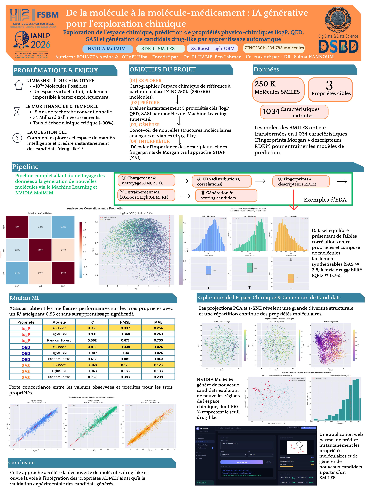
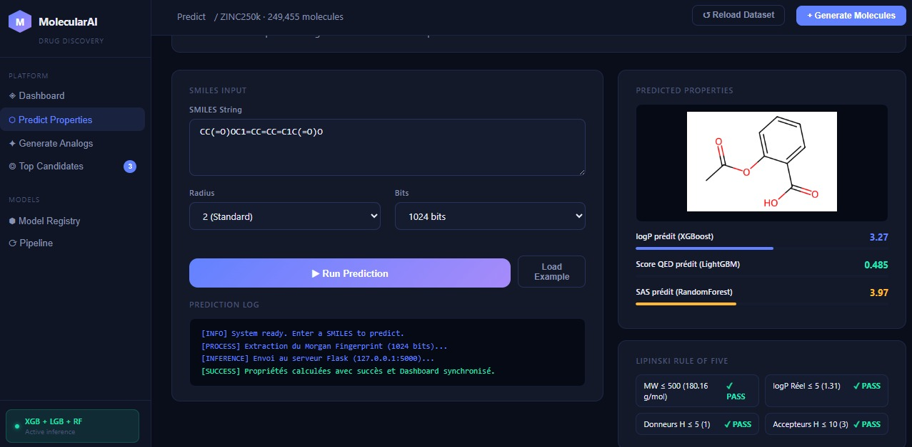
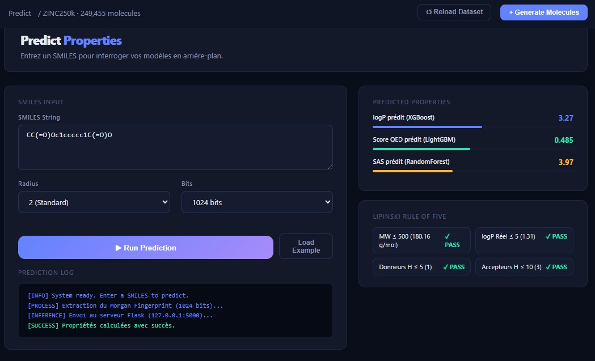

# 🧬 Molecular AI Dashboard

An AI-powered platform for **molecular property prediction** and **drug candidate generation** using Machine Learning and Generative AI.

This project integrates **Machine Learning**, **RDKit**, and **NVIDIA MolMIM** to predict molecular properties, explore chemical space, and generate promising drug-like candidates through an interactive web dashboard.

---

# 📌 Project Poster

The following poster presents the complete project, including the problem statement, objectives, machine learning pipeline, experimental results, chemical space exploration, and the developed web application.

  

---

# 🖥️ Interactive Dashboard

An intuitive web dashboard was developed to allow real-time molecular analysis from a SMILES string.

## 🔹 Prediction Interface

The prediction page enables users to input a SMILES molecule, extract Morgan fingerprints, and instantly predict three important molecular properties (**logP**, **QED**, and **SAS**) while evaluating the Lipinski Rule of Five.

  

---

## 🔹 Prediction Results

After inference, the dashboard displays the predicted molecular properties, the molecular structure, drug-likeness evaluation, and prediction logs, providing a complete overview of the generated results.

  

---

# 🚀 Technologies

- Python
- Flask
- RDKit
- XGBoost
- LightGBM
- Random Forest
- Scikit-learn
- HTML / CSS / JavaScript
- Plotly
- NVIDIA MolMIM

---

# 👩‍💻 Author

**Amina Bouazza**

Master's in Artificial Intelligence (DSBD & IA)

Faculty of Sciences Ben M'Sick

Hassan II University of Casablanca
